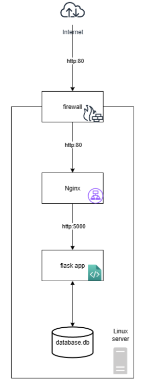

# Ansible Role for deploying app in Debian or CentOS.

This Ansible role deploys infrastructure for a [simple web application](https://github.com/riad-azz/flask-auth-example).
It automates package installation, web server and reverse proxy configuration, a systemd service for the app, firewall,
logging and logrotation, simple monitoring, cron tasks for health checks and backups, and an optional Docker Compose
deployment mode.

### Content

------------

- [Ansible Role for deploying app in Debian or CentOS.](#ansible-role-for-deploying-app-in-debian-or-centos)
    - [Content](#content)
    - [Architecture](#architecture)
    - [Requirements](#requirements)
    - [Role Variables](#role-variables)
      - [flask-auth-example](#flask-auth-example)
    - [Dependencies](#dependencies)
    - [Example Playbook](#example-playbook)
    - [How to use it](#how-to-use-it)
    - [Tips and tricks](#tips-and-tricks)
    - [TroubleShooting](#troubleshooting)
    - [License](#license)

### Architecture



### Requirements

------------

* Ansible collections: **community.general**, **community.docker**.
* Target server with **Debian/Ubuntu** or **Fedora/CentOS/RHEL**.
* On **Fedora/CentOS/RHEL** you should disable **SELinux**.
* On target server you should create user **devops** and provision **SSH** key access.

### Role Variables

--------------

#### flask-auth-example

```yml
user:                 string  # default 'devops'
user_group:           string  # default 'devops'
repo:                 string  # default is app url
app_name:             string  # default 'flask-auth-example'
app_path:             string  # default '/srv'
host_name:            string  # default 'test.local'
requirements_path:    string  # default $app_path/requirements.txt
venv_path:            string  # default '$app_path/venv'
log_dir:              string  # default '/var/log/auth_server'
docker:               boolean # default false
packages_map:         map     
nginx_packages_map:   map
docker_packages_map:  map
allowed_ports:        list
```

### Dependencies

------------

Requires Ansible >= 2.8

### Example Playbook

----------------

Example host file:

```sh
[targets]
localhost ansible_ssh_host=8.8.8.8 ansible_user=root ansible_ssh_private_key_file=~/.ssh/id_rsa
```

Example playbook:

```yml
- hosts: all
  become: true
  roles:
    - flask-auth-example
  vars:
    docker: false
```

### How to use it

----------------

```sh
ansible-playbook -i [HOST_FILE] [PLAYBOOK]
ansible-playbook -i test-host playbook.yml --key-file=test-ssh/id_rsa --tags="package_install" --check
```

### Tips and tricks

----------------

Running a playbook in dry-run mode or check for bad syntax

```sh
--check
--syntax-check
```

A list of tasks/hosts to complete for ansible playbook

```sh
--list-tasks
--list-hosts
```

Ansible tags

```sh
--skip-tags "docker"
--tags="nginx_setup"
```

Use another keys

```sh
--key-file=test-ssh/id_rsa
```

Verbose mode

```sh
-v    # log level 1
-vvvv # log level 4
```

### TroubleShooting

----------------

When running jobs the returned output does not format carriage returns and newline characters (\r\n & \n).
This could be fixed to return cleaner output like the standard command module.

```sh
ansible-playbook [........] |  sed 's/\\n/\n/g'
```

### License

-------

BSD
